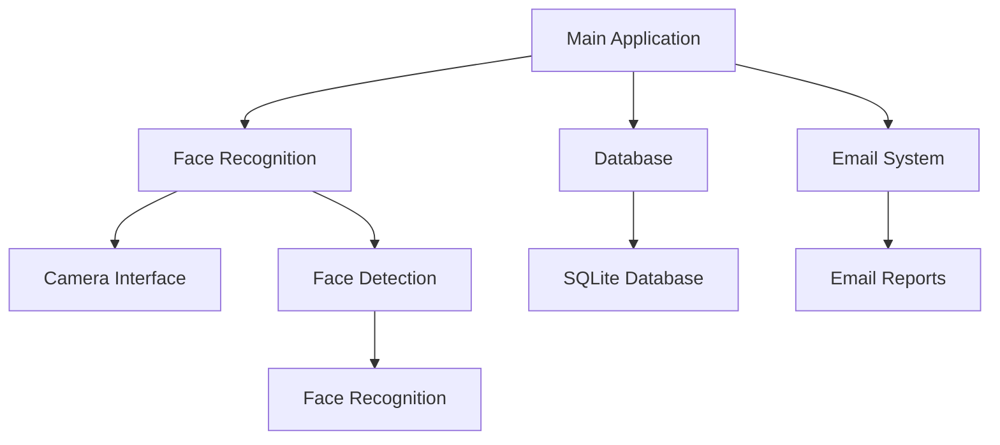

# 🎯 AI-Powered Face Recognition Attendance System

<div align="center">


</div>

## 🌟 Features

- 🎥 **Real-time Face Detection** - Instant face detection using advanced computer vision
- 👥 **Multi-Face Recognition** - Accurately identify multiple people simultaneously
- 📊 **Attendance Tracking** - Automated weekly attendance management
- 📈 **Analytics Dashboard** - Visual reports and attendance statistics
- 📧 **Email Notifications** - Automated attendance reports via email
- 🔐 **Secure Admin Panel** - Protected access to administrative functions
- 💾 **Database Integration** - Reliable SQLite database for data storage
- 🎨 **Modern UI Design** - Sleek and intuitive user interface

## 🚀 Quick Start Guide

### Prerequisites

- 🐍 **Python 3.8.5** - [Download](https://www.python.org/downloads/release/python-385/)
- 📦 **Anaconda/Miniconda** - [Download](https://www.anaconda.com/download)
- 📸 **Webcam**
- 💻 **Windows 10** or later

### 🔧 Installation

1. **Download the Package**
   - Download `Face_Recognition_FINAL_PACKAGE.zip`
   - Extract to a simple path (e.g., `C:\FaceRecognition`)

2. **Run Setup**
   ```bash
   # Open Command Prompt as Administrator and navigate to extracted folder
   cd /d C:\FaceRecognition
   
   # Run test script
   test_setup.bat
   
   # If test passes, run the application
   run.bat
   ```

## 📱 Usage Guide

### 👤 User Registration
1. Click "Register New Face"
2. Enter Student/Staff ID
3. Position face in frame
4. Press 'S' to save

### ✅ Mark Attendance
1. Click "Mark Attendance"
2. Select student name
3. Choose week number
4. Click "Start Face Scan"

### 👨‍💼 Admin Features
- 📊 View attendance reports
- 📧 Send email notifications
- 👥 Manage user database
- 📈 View analytics dashboard

## 🎨 Interface Preview

<div align="center">
<table>
  <tr>
    <td><b>Main Screen</b><br>Modern and intuitive interface</td>
    <td><b>Registration</b><br>Face detection with landmarks</td>
    <td><b>Attendance</b><br>Weekly tracking system</td>
  </tr>
</table>
</div>

## 🛠️ Technical Details

### Technology Stack
- **Face Recognition**: `dlib`, `face_recognition`
- **Interface**: `tkinter` with modern styling
- **Vision**: `OpenCV`
- **Data**: `numpy`, `pandas`
- **Storage**: `SQLite3`
- **Communication**: `smtplib`

### System Architecture


## 🔒 Security Features
- 🔑 Secure admin authentication
- 🔐 Encrypted face encodings
- 📝 Attendance verification
- 🕒 Timestamp validation

## 📈 Performance
- Fast face detection and recognition
- Efficient database operations
- Low resource consumption
- Quick startup time

## ⚙️ Configuration
System settings can be customized in:
- `environment.yml` - Environment configuration
- `config.txt` - Application settings
- `database.db` - User database

## 🤝 Support & Contribution

### Getting Help
- 📧 Email: support@example.com
- 🐛 Issue Tracker: GitHub Issues
- 💬 Discussion: GitHub Discussions

### Contributing
1. Fork the repository
2. Create a feature branch
3. Commit your changes
4. Push to the branch
5. Create a Pull Request

## 📝 License
This project is licensed under MIT License.

---

<div align="center">

### ⭐ Star this repository if you find it helpful!

Made with ❤️ by [ohansfav](https://github.com/ohansfav) and copiliot

</div>
